# Install Cowork AI OS — step by step

This is the exact click path from the install video, with screenshots. Works on Windows and Mac. Budget 10 minutes for the install, then 30–90 minutes for the onboarding conversation.

**Before you start, you need:**

- A computer. Claude Cowork runs on your desktop or laptop (Windows or Mac). It does not run in a browser tab or on a phone.
- A paid Claude plan. **Pro is enough.** Max also works. The free plan does not include Cowork.

---

## Part 1 — Get Claude Desktop on your computer

Skip to Part 2 if you already have the Claude Desktop app installed.

**1. Sign in at claude.ai.** Open your browser, go to `claude.ai`, and sign in. If you need a plan, click your initials (bottom-left) → **View all plans** and pick Pro.

**2. Open the downloads page.** Click your initials in the bottom-left corner → **Get apps and extensions**.

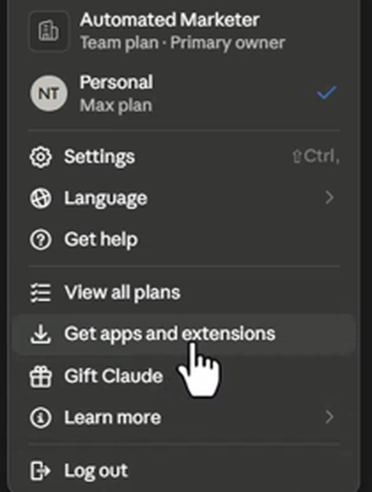

**3. Download the Desktop app.** Scroll to the **Desktop** card and click **Download for Windows** (on a Mac it says **Download for Mac**).

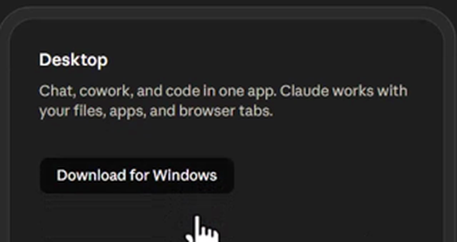

**4. Run the installer.** It lands in your Downloads folder as `Claude Setup.exe` (Windows) or a `.dmg` (Mac). Open it. If Windows asks "Do you want to allow this app to make changes?", click **Yes**. Claude installs and opens itself.

**5. Find the app.** Look for the orange asterisk icon in your taskbar (Windows) or Dock (Mac). Double-click it. You'll land on the **Chat** tab.

**6. Check for updates.** Top-left menu (☰) → **Help** → **Check for Updates**. The app updates often; do this now.

**7. One setting to turn on now.** Click your name (bottom-left) → **Settings** → **Capabilities**. Scroll to **Domain allowlist** and set it to **All domains**. Without this, Claude cannot reach the internet from inside a task.

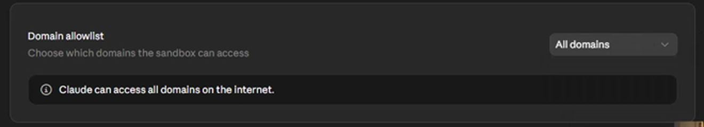

Leave **Instructions for Claude** (under Settings → General) empty for now. The onboarding fills it in for you.

---

## Part 2 — Create the folder Cowork will work in

Cowork works best inside one folder. Everything it creates lives there.

**8. Make a folder called `Claude Cowork`.** Put it wherever you keep your files: your Desktop, your Documents, or a storage drive. Location doesn't matter — you just need to be able to find it again.

- Windows: open **File Explorer**, go to the place you want, right-click an empty area → **New** → **Folder** → name it `Claude Cowork`.
- Mac: open **Finder**, go to the place you want, **File** → **New Folder** → name it `Claude Cowork`.

**9. Point Cowork at it.** Back in the Claude app, click the **Cowork** tab at the top-left. Under the text box, click the **Work in a project ▾** dropdown → **Choose a different folder**.

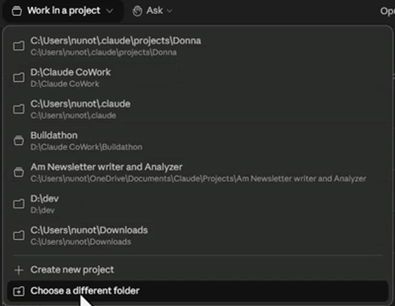

**10. Select the folder.** In the file dialog, find your `Claude Cowork` folder, click it once, then click **Select Folder** (Mac: **Open**).

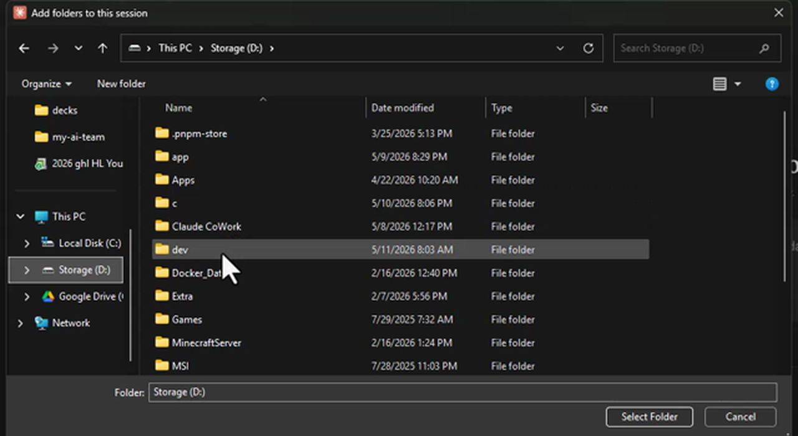

The dropdown under the text box now shows your folder path. That's Part 2 done.

---

## Part 3 — Install the Cowork AI OS plugin

**11. Open Customize.** Still on the Cowork tab, click **Customize** in the left sidebar. You'll see **Skills**, **Connectors**, and **Personal plugins** with a small **+** next to it.

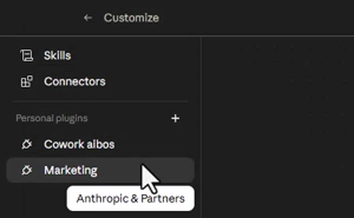

**12. Add the marketplace.** Click the **+** next to **Personal plugins** → hover **Create plugin ▸** → click **Add marketplace**.

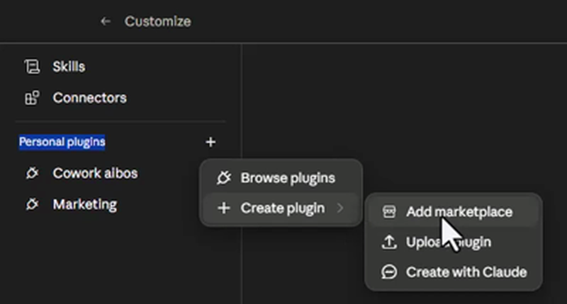

**13. Paste the repo name.** In the **URL** box type exactly:

```
AutomatedMarketer/cowork-ai-os
```

Then click **Sync**. Give it a few seconds. (The red warning is standard for every third-party plugin.)

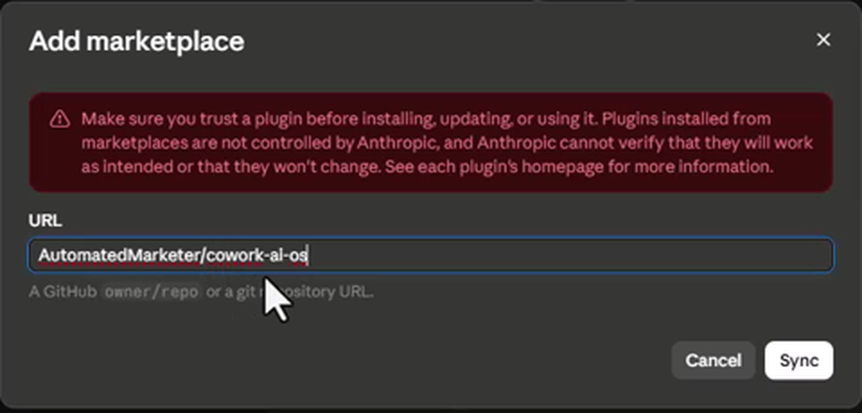

**14. Install it.** The **Directory** window opens. Click the **Personal** tab at the top, then the **cowork-ai-os** sub-tab. You'll see the card **Cowork ai os — Nuno Tavares**. Click the **+** on the right side of the card.

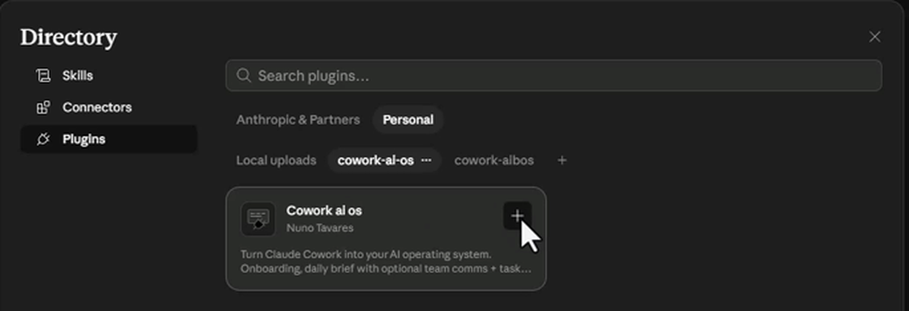

**15. Confirm it installed.** A message appears top-right: **"Cowork ai os is installed and ready to use."** The **+** on the card turns into a **cogwheel ⚙**, and **Cowork ai os** now appears under Personal plugins in the left sidebar. Close the Directory window.

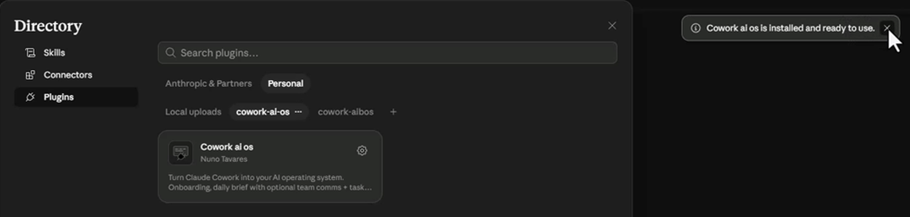

> **If the Directory window didn't open after Sync:** click the **+** next to Personal plugins again → **Browse plugins** → **Personal** tab → **cowork-ai-os**. A **cogwheel** on the card means it's already installed. A **+** means it isn't — click it.
>
> 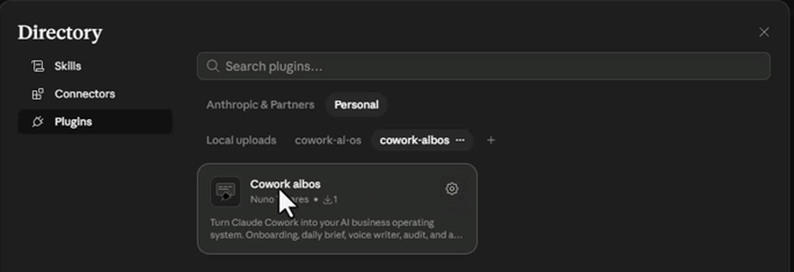

---

## Part 4 — Start the onboarding

**16. Go back to a new task.** Click **New task** in the left sidebar. Check that the folder dropdown still shows your `Claude Cowork` folder.

**17. Set it to ask first.** Click the **Ask ▾** dropdown and make sure **Ask before acting** is ticked. Claude will pause and ask before it changes anything.

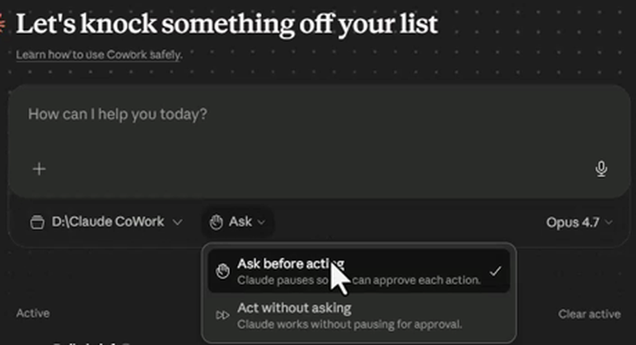

**18. Pick a cheaper model.** Click the model name on the right (it usually says Opus) and choose **Sonnet**. It's more than enough for onboarding and costs far less of your plan.

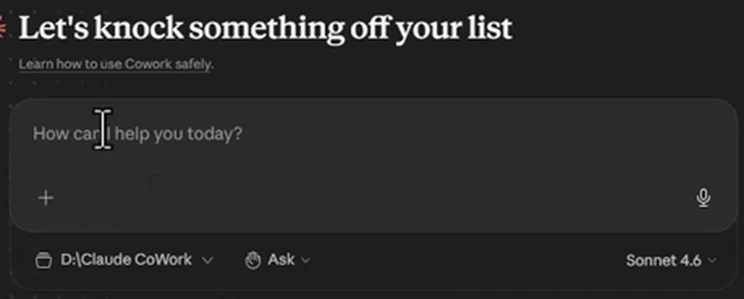

**19. Type the start command.** In the text box type:

```
start onboarding
```

and press the orange **↑** send button (or Ctrl+Enter).

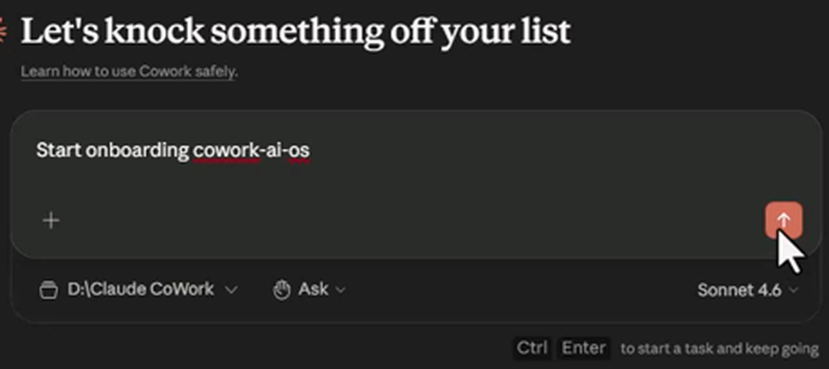

**20. Answer the questions.** Claude pulls in the plugin's instructions and walks you through nine short phases: handbook, who you are, your business, your voice + memory, connectors, folders, skills, cadence, verify. Answer with real, current information — the better you answer, the better it works. You can stop at any phase and type `start onboarding` again later to resume where you left off.

---

## Things to know

- **Everything is per computer.** Plugins, skills and connectors you add here live on this machine only. On a second computer, repeat Parts 1–3.
- **Connector permissions.** When you connect a tool (Gmail, ClickUp, Drive…), go to Settings → Connectors → that tool, and set **read-only tools to Always allow** and **write/delete tools to Needs approval**.
- **Claude in Chrome.** Settings → Claude in Chrome → allow the extension. It lets Claude use your browser for you.
- **Keep computer awake** (Settings → Desktop app → General) is unreliable on Windows PCs. It works well on Macs.
- **Cost.** Stay on Sonnet for everyday tasks. Switch to Opus only when a job genuinely needs it.
- **Running onboarding a second time in the same folder** shows "What already exists…" and picks up from the last completed phase. That's expected.

---

## Links

- **Cowork AI OS on GitHub:** https://github.com/AutomatedMarketer/cowork-ai-os
- What each bundled skill does: [../../README.md](../../README.md)
- Connector guide: [../../CONNECTORS.md](../../CONNECTORS.md)
